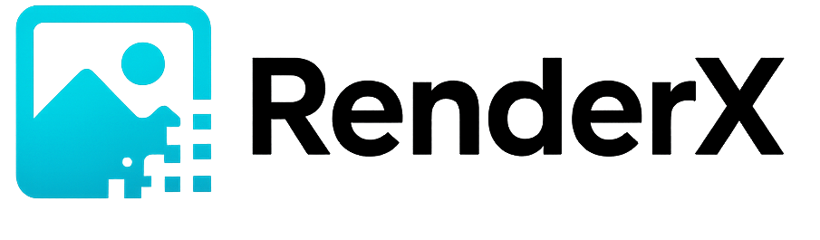

<!DOCTYPE html>
<html lang="pt-BR">
<head>
  <meta charset="UTF-8">
  <meta name="viewport" content="width=device-width, initial-scale=1">
  <title>RenderX - Catalogo & Estrategias de Vendas</title>
  
</head>
<body>
  

    <header>
      <!-- coloque a imagem 'logo.png' na mesma pasta do index.html -->
      
      <h1>RenderX</h1>
      <h2>Catalogo & Estrategias de Vendas</h2>
      
Transformando imagens em experiencias visuais impactantes

      
Ofertas Exclusivas - RenderX

    </header>

    

      <table>
        <thead>
          <tr>
            <th>Pacote</th>
            <th>Quantidade de Imagens</th>
            <th>Preco</th>
          </tr>
        </thead>
        <tbody>
          <tr>
            <td>Pacote Premium</td>
            <td>10 imagens</td>
            <td>R$ 97,00</td>
          </tr>
          <tr>
            <td>Pacote Intermediario</td>
            <td>5 imagens</td>
            <td>R$ 47,00</td>
          </tr>
          <tr>
            <td>Pacote Essencial</td>
            <td>3 imagens</td>
            <td>R$ 37,00</td>
          </tr>
        </tbody>
      </table>
    

    

      
Para Restaurantes

      
A primeira impressao do seu prato comeca pela foto!

      
Fotos bem trabalhadas aumentam o apetite e as vendas.

      
Transforme seu cardapio digital em uma verdadeira vitrine gourmet.

    

    

      
Para Veiculos

      
Fotos profissionais valorizam ainda mais o seu carro.

      
Destaque os detalhes que fazem toda diferenca na hora da venda.

      
Uma imagem de qualidade acelera a decisao do comprador.

    

    

      
Para Anuncios em Geral

      
Uma imagem restaurada e um anuncio mais convincente.

      
Atraia mais clientes com fotos claras e impactantes.

      
Invista em qualidade visual para turbinar seus resultados.

    

    

      
Beneficios Extras

      
Quanto mais imagens voce adquire, mais economia voce garante!

      
Pacotes pensados para atender sua necessidade e caber no seu bolso.

      
Garanta ja suas imagens profissionais com o melhor custo-beneficio.

      
Ideal para empresas que desejam impacto visual sem gastar muito.

      
Escolha o pacote que mais se encaixa no seu momento e comeca hoje mesmo!

      
Investir em qualidade nunca foi tao acessivel.

      
Aproveite essa oportunidade exclusiva da RenderX!

    

  

</body>
</html>
